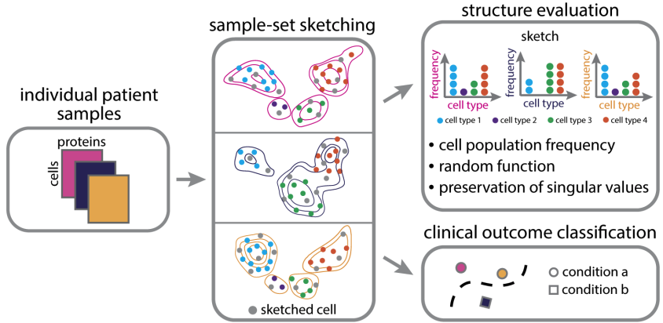

# SketchKH
Distribution-Informed Sketching with Kernel Herding 

## Overview
We provide a set of functions for distribution-aware sketching of multiple profiled single-cell samples via Kernel Herding. Our sketeches select a small, representative set of cells from each profiled sample so that all major immune cell-types and their relative frequencies are well-represented. 
* Please see our paper for more information (ACM-BCB 2022) : https://arxiv.org/abs/2207.00584
* Updated : July 25, 2022



## Installation
Dependencies
* Python >= 3.6, anndata 0.7.6, numpy 1.22.4, scipy 1.7.1, tqdm 4.64.0, scanpy 1.8.1

You can clone the git repository by,
```
git clone https://github.com/CompCy-lab/SketchKH.git
```

## Example usage
To perform sketching, first read in a preprocessed `.h5ad` adata object. This dataset contains multiple profiled single-cell samples. Hence, sketches will select a limited set of cells from each profiled sample. We refer to each profiled sample as a *sample-set*. 

```python
import scanpy as sc
import os
adata = sc.read_h5ad(os.path.join('data', 'nk_cell_preprocessed.h5ad'))
```
Then simply sketch your data by,
```python

# Inputs
# adata: annotated data object (dimensions = cells x features)
# sample_set_key: string referring to the key within adata.obs that contains the sample-sets to subsample
# sample_set_inds: (alternative to specifying sample_set_key) list of arrays containing the indices of the sample-sets to subsample 
# gamma: scale parameter for the normal distribution standard deviation in random Fourier frequency feature computation
# frequency_seed: random state
# num_subsamples: number of cells to subsample per sample-set
# n_jobs: number of tasks
# ----------------------------

# Returns:
# kh_indices: list of indices referencing the subsampled cells per sample-set
# adata_subsample: downsampled annotated data object (dimensions = num_subsamples*sample-sets x features)

# ----------------------------
from kh import sketch
kh_indices, adata_subsample = sketch(adata, sample_set_key = 'FCS_File', gamma = 1, num_subsamples = 500, n_jobs = -1)
```
